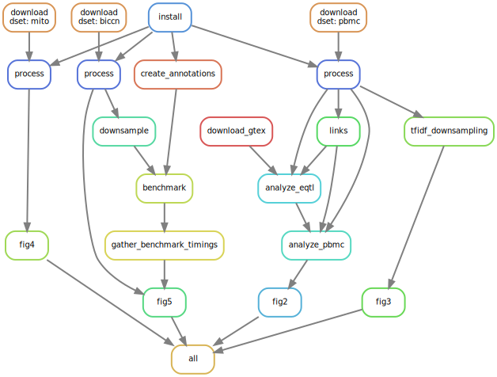

## Signac paper

Code to reproduce analyses shown in Stuart et al. 2020

To run the workflow, first create a new conda environment containing the dependencies:

```
mamba env create -f environment.yaml
```

The entire workflow can be run by executing:

```
snakemake --cores 8
```


